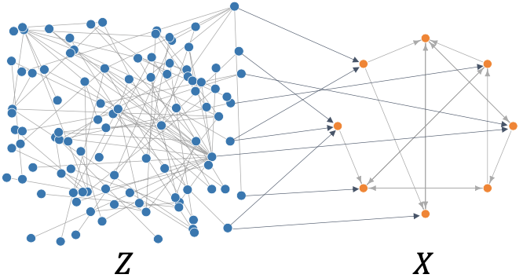

# Confounder Blanket Learner


The confounder blanket learner (CBL) algorithm is a causal discovery method designed for two-tiered datasets, in which the goal is to identify ancestral relationships among foreground variables X based on differential signals from a (potentially much larger) set of background variables Z. This is useful whenever a partial order on subgraphs is known, e.g. when using genetic data to infer regulatory networks. The method is sound and complete with respect to a so-called "lazy oracle". Stability selection is used for finite sample error control. For details, see ([Watson & Silva, 2022](https://arxiv.org/abs/2205.05715)).  

To install the package directly from GitHub, run the following in R:
``` r
devtools::install_github('dswatson/cbl')
```